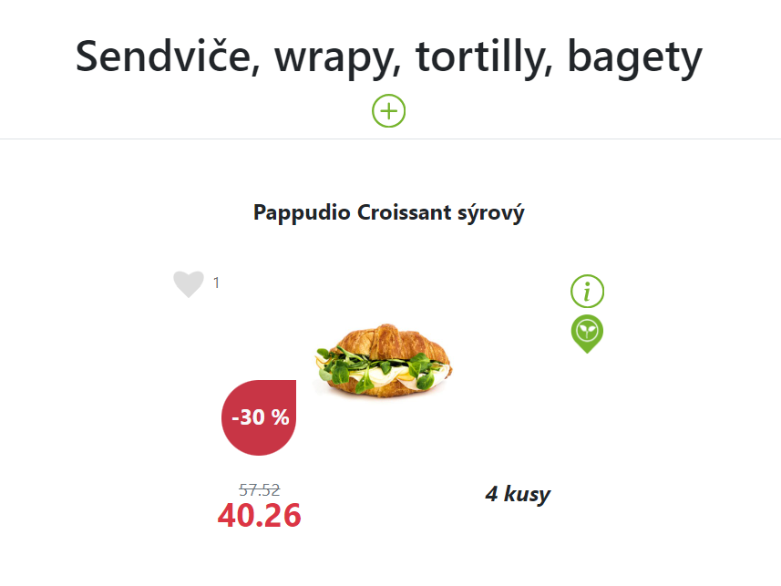

Introduction
============

FreshPoint webpages provide information about products available in FreshPoint
vending machines on certain locations. Most of that information can be parsed.

Breaking Down the Page URL
--------------------------

The URL of the webpage consists of the base URL, an intermediate path, and the
location ID of the vending machine. **Location ID**, sometimes also referred
to as the page ID, is a numerical value used by FreshPointSync to identify
a specific vending machine to parse the product information from.
For example, URL *my.freshpoint.cz/device/product-list/296*
corresponds to the location ID *296*.

Understanding the Page Layout
-----------------------------

The top of the page includes the **location name** and the navigation bar with
available product categories. Bellow follow the product listings separated into
**categories**. Only the products that are currently in stock are displayed
by default.

Analyzing a Product Listing
---------------------------

Each product listing includes the following information:

* **Name:** The name of the product.
* **Image:** An illustration image of the product.
* **Description Badges:** Badges indicating characteristics of the product
  (e.g., vegetarian, gluten-free), a brief description, and the number of likes.
* **Price:** The price of the product. If the product is on sale, the sale price
  and the sale rate are displayed along with the original price.
* **Availability:** The number of available pieces of the product. If there is
  only one item left, the availability is displayed as "poslední kus".
  If the product is out of stock, the availability text is not displayed.

   A product from the FreshPoint catalog

On the illustration above, you can see a product listing "Pappudio Croissant
sýrový" under the category "Sendviče, wrapy, tortilly, bagety". The product is
vegetarian, is on sale for 40.26 CZK (30% off the original price of 57.52 CZK),
and is available in 4 pieces. The product has one like.

.. note::

   The number of likes cannot be parsed by FreshPointSync at the moment.
